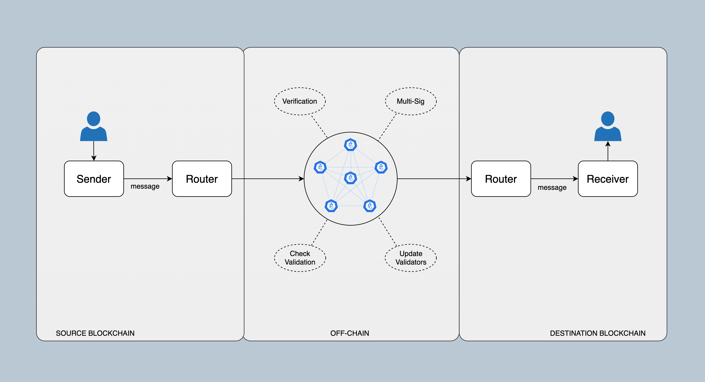

# Cross-chain Messaging

Cross-chain messaging (CCM) is a crucial feature in the Equito Protocol ecosystem, allowing users to seamlessly send messages between different blockchain networks. This capability is particularly valuable for applications that require minimal logic or state synchronization across multiple chains, as well as for scenarios where unidirectional data transmission is sufficient.

## Architecture of CCM

CCM operates through the deployment of specialized contracts on two or more interconnected blockchain networks. At the core of this communication mechanism lies the Equito Protocol, which serves as a reliable relayer responsible for transferring messages between these blockchains.

The process of sending a message via CCM involves several steps:

1. **Message Initiation**: To send a message from one blockchain (the source chain) to another (the destination chain), a user initiates the process by calling the `send()` function of the sender contract on the source chain.

2. **Message Relaying**: Equito Protocol intercepts and facilitates the transfer of the message from the source chain to the destination chain. This inter-chain transfer is executed securely and efficiently, ensuring that the message remains intact and confidential throughout the process.

3. **Message Reception**: Upon reaching the destination chain, the message is received by a designated CCM contract. The CCM contract processes the incoming message through its `onReceiveMessage()` function, which enables the execution of specific actions or interactions on the destination chain.

## Use Cases of CCM

Cross-chain messaging in Equito Protocol is particularly well-suited for a range of use cases, such as:

- **Contract Interaction**: Applications that require seamless interaction with contracts deployed on different chains can benefit from CCM. This includes calling contract functions or sending value to addresses on remote blockchains without the need for complex state synchronization.

- **One-Way Data Transfer**: CCM is ideal for scenarios where data only needs to be transmitted from one chain to another in a unidirectional manner. In these cases, the sender does not require feedback or results from the destination chain, streamlining the communication process.

## Security and Confidentiality

Equito Protocol places a strong emphasis on the security and confidentiality of all cross-chain messages. All message data is encrypted and secured, ensuring that sensitive information remains protected throughout the communication process. This commitment to data privacy and security is essential for maintaining user trust and safeguarding valuable assets.

## Decentralized Validation and Consensus

In Equito Protocol, a network of validators acts as decentralized observers responsible for reaching consensus on relevant external state and events across interconnected blockchains. These validators also have the capability to update external chain state through multi-signature signing, ensuring the integrity and accuracy of cross-chain transactions.

Equito Protocol's approach to decentralized validation and consensus is characterized by its trustless, permissionless, transparent, and efficient nature. By eliminating single points of failure and central authority, Equito Protocol provides a robust infrastructure for cross-chain messaging that users can rely on with confidence.

## Fee of CCM

The cost for a single message is $0.1.
