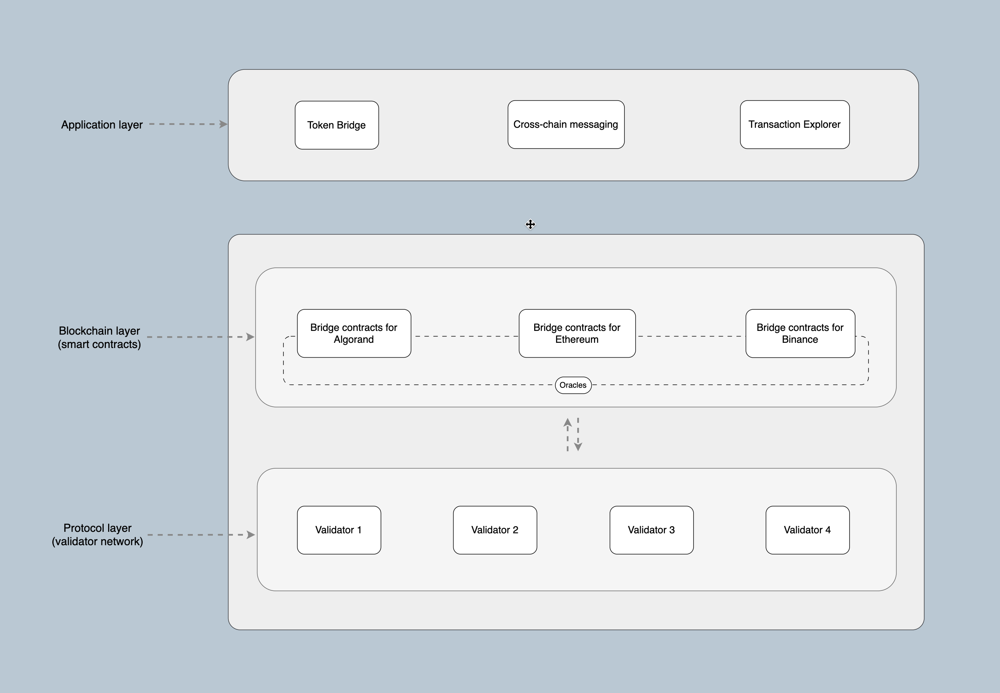

# Explore Equito Protocol

## Network Architecture

### Equito Protocol

The Equito Protocol is controlled by on-chain smart contracts powering the protocol, oracles that transfer data from one network to another and validators that authenticate transactions on the network. The network is uncontrolled and maintains security by ensuring validators run the same process upon receiving the various chains events. Only when two-thirds of validators have signed the same transaction with their key collectively, the network achieves consensus.

### Protocol Layers

The Equito Protocol consists of three main layers:

1. Application Layer - Made up of all the cross-chain tools Any cross-chain tool can be built on the Equito Protocol application layer and plugged into the blockchain and protocol layer. The Application layer supports different kinds of applications like the token bridge, cross-chain messaging, and others in the works.
2. Blockchain Layer (smart contracts) - Contains contracts for supported blockchains and oracles that act as data relayers.
3. Protocol Layer (validator network) - Combines the blockchain layer with the validators. Every cross-chain transaction initiated through bridge contracts is assigned a unique identifier (hash). Equito Protocol validators track every transaction that passes through the smart contract of the protocol and soon as the transaction achieves its entirety, each validator is required to sign the transaction by its private key, all the while the oracle transfer the data to different chains.

## Benefits of Equito Protocol

Equito Protocol offers several advantages over traditional cross-chain transaction methods:

- **Cost-Efficiency**: The protocol significantly reduces gas fees by verifying only one multi-signature transaction, making cross-chain transactions more affordable.
- **Enhanced Scalability**: Equito Protocol's approach enhances the scalability of cross-chain transactions, allowing for increased throughput and faster processing times.
- **Security**: Ed25519 signatures and Zero-Knowledge Proofs provide a high level of security, ensuring the integrity and privacy of transactions.
- **Interoperability**: Equito Protocol promotes seamless interoperability between different blockchain networks, fostering a more connected blockchain ecosystem.

## Use Cases

Equito Protocol can be applied to various use cases, including:

- **Asset Bridging**: Facilitating the transfer of assets between different blockchain networks.
- **Cross-Chain DeFi**: Enabling cross-chain decentralized finance (DeFi) transactions, lending, and yield farming.
- **Interconnected Applications**: Supporting the exchange of data and information between decentralized applications (dApps) on different blockchains.
