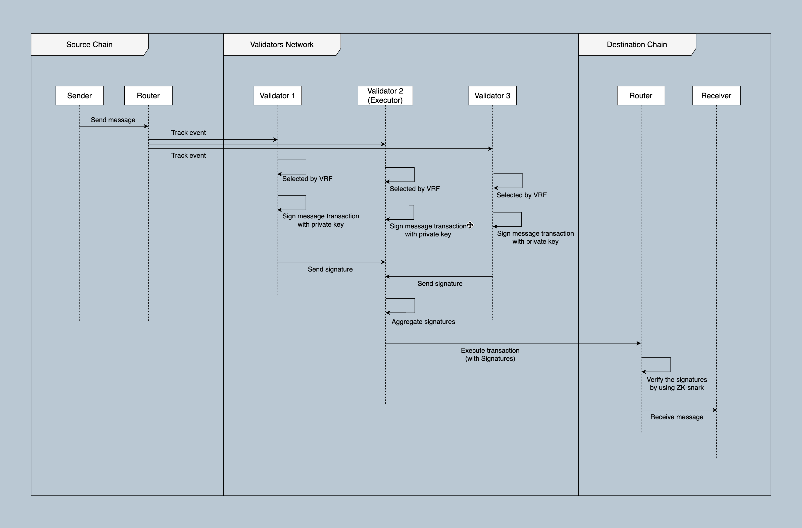

# Validator Network

The Equito Bridge is an innovative protocol designed to enhance the security and efficiency of cross-chain transactions by leveraging Zero-Knowledge Proofs (ZKPs). In the world of blockchain interoperability, the verification of validator signatures can impose significant gas fees, making it impractical for frequent cross-chain transactions. Equito Bridge addresses this challenge by using Zero-Knowledge Proofs, wherein it verifies a single multi-signature transaction through Ed25519 signature verification using ZKPs. This innovative approach substantially reduces gas fees and enhances the scalability of cross-chain transactions.

## Problem Statement

When conducting transactions between different blockchain networks, it is essential to verify the signatures of validators. Validator signature verification typically incurs substantial gas fees, making it economically infeasible for frequent cross-chain transactions. Equito Bridge addresses this issue by using Zero-Knowledge Proofs, allowing it to verify only one multi-signature transaction instead of numerous individual validator signatures.

## Zero-Knowledge Proofs in Equito Bridge

### What is Zero-Knowledge Proofs

Zero-Knowledge Proofs (ZKPs) is a method by which one party (the prover) can prove to another party (the verifier) that a given statement is true, while avoiding conveying to the verifier any information beyond the mere fact of the statement's truth. The intuition underlying zero-knowledge proofs is that it is trivial to prove the possession of certain information by simply revealing it; the challenge is to prove this possession without revealing the information, or any aspect of it whatsoever.

### ZKPs in Equito Bridge

Zero-Knowledge Proofs are integral to the security framework of the Equito Bridge protocol. These cryptographic techniques enable the verification of transactions on-chain without compromising sensitive information, upholding transaction integrity while preserving user privacy.

In the context of Equito Bridge, ZKPs play a pivotal role in validating multi-signature transactions off-chain. This application ensures that transaction data remains confidential, as parties involved can prove the validity of ownership without disclosing specific transaction details. For instance, a user can demonstrate possession of the private key associated with a particular public key without revealing the key itself, enhancing confidentiality in financial transactions where compliance with predefined conditions is crucial.

The implementation of zero-knowledge proofs in Equito Bridge is exemplified by zk-SNARKs (Zero-Knowledge Succinct Non-Interactive Arguments of Knowledge). These proofs facilitate the verification of transaction validity through concise and easily verifiable proofs.

## Security Measures

Security is paramount in Equito Bridge. The use of Ed25519 signatures and Zero-Knowledge Proofs ensures that transactions are not only efficient but also highly secure. Validators play a crucial role in maintaining the security of the bridge, and their signatures are protected against unauthorized access.

## Smart Contract Implementation

Equito Bridge implements smart contracts to enable cross-chain transactions. These contracts utilize Zero-Knowledge Proofs to validate multi-signature transactions. This on-chain verification process ensures that the transactions are executed securely and without the need for extensive signature validation.

## Validator Roles

Validators in the network are responsible for:

- Providing uptime to relay transactions
- Monitoring bridging events on the source chain.
- Transfer messages from source chain to destination chain.
- Approving, siging bridge transactions with multi-sig, and execute them.
- Detecting frad validators and actions and blocking them.
- Updating validators when new one is added.

## How does it work

An Equito Finance validator participates in verifying transactions and multi-signing them.

The transaction process in Equito Bridge is streamlined to maximize efficiency and minimize gas fees. All bridge transactions are approved and signed off-chain by validators using multi-sig. The primary feature of validator network is to use multi-sig that requires signatures from multiple validators to authorize transactions. Network consensus is reached when at least two-thirds of validators collectively sign the same transaction using their keys. Once signed, the multi-signature transaction is submitted to a smart contract on the respective chains. The smart contract uses ZKPs to verify the transaction on-chain, significantly reducing gas fees and enhancing scalability.

**Multi-Signature (Multi-Sig) Technology**
Multi-signature technology is a fundamental component of Equito Bridge's transaction process. It's used to enhance security and establish consensus among a network of validators before a transaction proceeds to the smart contract on the destination chain.

1. **Implementation**: Equito Bridge employs a network of validators, each of whom holds a cryptographic key. To initiate a cross-chain transaction, the sender's blockchain interacts with these validators. A predetermined quorum, typically two-thirds of the validators, must sign off on the transaction to achieve consensus.

2. **Consensus Establishment**: Validators review the transaction details and, if everything aligns with predefined criteria, they sign the transaction with their respective keys. This multi-signature requirement ensures that no single validator can unilaterally authorize a transaction. This enhances security by preventing rogue validators from compromising the network.

3. **Transaction Authorization**: Once the required number of validators have signed off on the transaction, it is considered authorized. This authorization is a critical checkpoint before the transaction proceeds further, assuring all involved parties of its legitimacy.

**Zero-Knowledge Proofs (ZKPs), Specifically zk-SNARKs**
Zero-knowledge proofs, particularly zk-SNARKs, are instrumental in Equito Bridge for achieving efficient and secure on-chain verification without revealing sensitive transaction details.

1. **Generation of zk-SNARKs**: When a multi-signature transaction is submitted to Equito Bridge's smart contract on the destination chain, the originating chain generates a zk-SNARK proof. This proof is derived from the complete transaction data, but it doesn't disclose the specifics.

2. **Efficient Verification**: Equito Bridge's smart contract is equipped with a zk-SNARK verification mechanism. Upon receiving a transaction along with its zk-SNARK proof, the smart contract can swiftly verify the proof without needing to access or reveal the underlying transaction data. This process is highly efficient and minimizes computational resources.

3. **Transaction Privacy**: The beauty of zk-SNARKs is that they preserve transaction privacy. Despite the smart contract verifying the transaction's authenticity, it does not gain access to transaction amounts, sender/receiver addresses, or other confidential details. This ensures that user privacy is maintained at a high level.

**Implementation within Equito Bridge**
The integration of these technologies is at the heart of Equito Bridge's functionality, ensuring secure, efficient, and privacy-preserving cross-chain transactions.

1. **Transaction Initiation**: When a user initiates a cross-chain transaction on Equito Bridge, it first goes through a multi-signature validation process involving the network of validators. This step establishes consensus and verifies the transaction's authenticity.

2. **Authorization**: Once the multi-signature requirement is met, the transaction is considered authorized and is then sent to the smart contract on the destination blockchain.

3. **Zero-Knowledge Proof Verification**: On the destination blockchain, the smart contract receives the transaction along with the accompanying zk-SNARK proof. The smart contract swiftly verifies the proof's authenticity, ensuring that the transaction adheres to all necessary criteria without exposing sensitive information.

4. **Gas Fee Reduction and Scalability**: The use of zk-SNARKs significantly reduces the gas fees associated with on-chain verification. Traditional on-chain verification processes can be resource-intensive and costly. However, zk-SNARKs streamline this process, resulting in substantial savings for users. Additionally, this efficiency contributes to the scalability of Equito Bridge, allowing it to handle a higher transaction volume without congestion.

5. **Privacy Enhancement**: By employing zk-SNARKs, Equito Bridge enhances user privacy. Transaction details remain confidential, preventing exposure of sensitive financial information to external observers.

## Validator Registration and Participation

Validators in the Equito Bridge network are registered automatically upon hosting, and all registered validators have the opportunity to actively participate in signing transactions. To ensure a dynamic and responsive network, new validators are periodically onboarded. New validator registrations are processed every 2 weeks.
