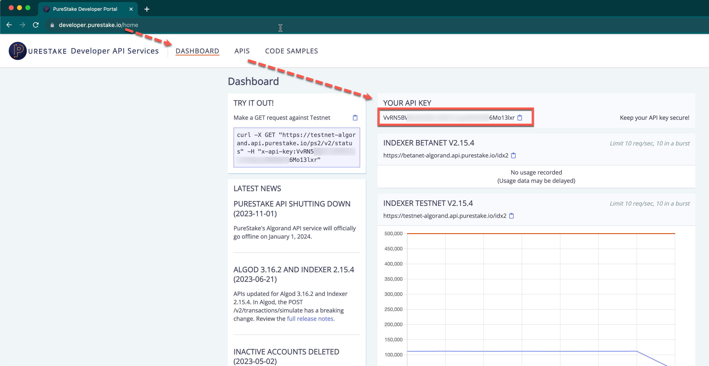
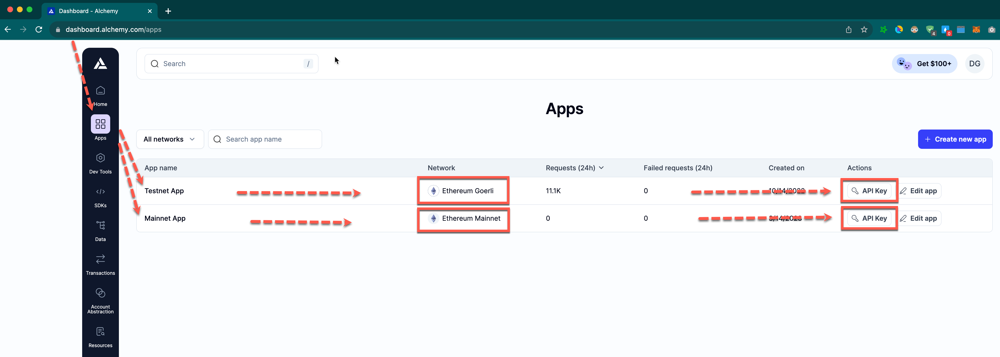
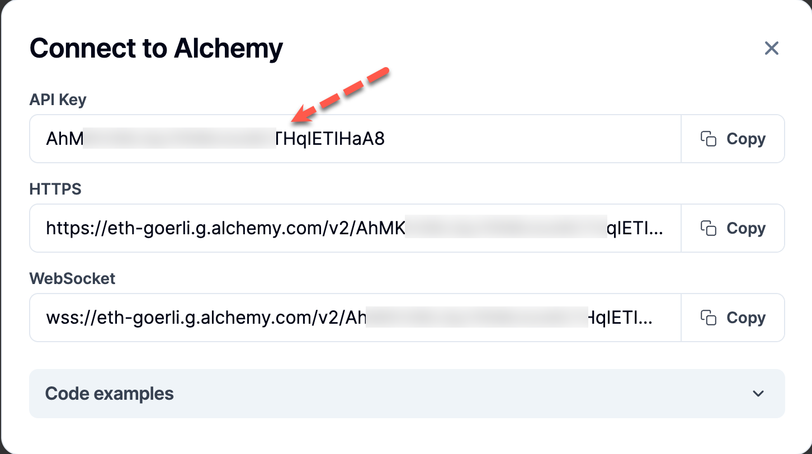
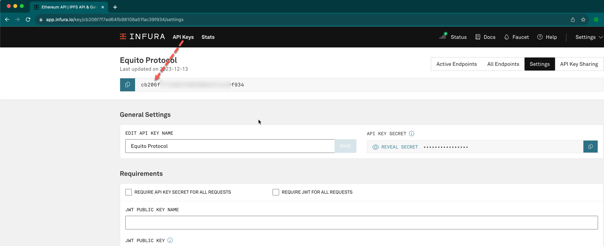

# Testing Guide

This guide will teach you how to run a Validator node locally using Docker. The Validator node will be configured to connect to the Goerli testnet.

## Install docker

1. Update your existing list of packages.

```sh
sudo apt update
```

2. Install a few prerequisite packages which let apt use packages over HTTPS.

```sh
sudo apt install -y apt-transport-https ca-certificates curl software-properties-common
```

3. Add the GPG key for the official Docker repository to your system.

```sh
curl -fsSL https://download.docker.com/linux/ubuntu/gpg | sudo apt-key add -
```

Add the Docker repository to APT sources.

```sh
sudo add-apt-repository "deb [arch=amd64] https://download.docker.com/linux/ubuntu focal stable"
```

4. Install Docker.

```sh
sudo apt install -y docker-ce
```

Docker should now be installed, the daemon started, and the process enabled to start on boot. Check that it’s running.

```sh
sudo systemctl status docker
```

## Using Docker

### Run PostgreSQL

1. Run PostgreSQL in a Docker container. You can replace mysecretpassword with your own password.

```sh
docker run --name eqt-postgres -e POSTGRES_PASSWORD=mysecretpassword -p 5432:5432 -d postgres
```

2. Confirm that the container is running. Note the 5432 port is published 0.0.0.0:5432->5432/tcp and therefore accessible outside of Docker.

```sh
docker ps -a -f name=eqt-postgres
```

If the container is running successfully, the output shows a healthy status:

```sh
CONTAINER ID   IMAGE      COMMAND                  CREATED         STATUS         PORTS                    NAMES
dc08cfad2a16   postgres   "docker-entrypoint.s…"   3 minutes ago   Up 3 minutes   0.0.0.0:5432->5432/tcp   eqt-postgres
```

### Run Validator node

1. Create a local directory to hold the Equito Protocol data

```sh
mkdir ~/.equito-node
```

2. Run the following command to create .env file and set environment variables. See how to get the API keys in [Configuring node](#configuring-node)

```sh
echo "
PORT=7890
ALGOD_API_KEY=<your-algod-api-key>
INFURA_KEY=<your-infura-key>
TESTNET_ALCHEMY_KEY=<your-testnet-alchemy-key>
MAINNET_ALCHEMY_KEY=<your-testnet-alchemy-key>
" > ~/.equito-node/.env
```

This is an example of .env setting.

```sh
echo "
PORT=7890
ALGOD_API_KEY=3HlRUk5h3G3UZeOWq3DN46boBkQ7yGI719WerzQN
INFURA_KEY=cb206f7f7ed64fb98108a56fac39f934
TESTNET_ALCHEMY_KEY=ldhqIo8W9kfM6jHV31W4Xuvk2O2PMYP8
MAINNET_ALCHEMY_KEY=cpW9bVq33Ac6lBjI2pwc266AKbGvl9MF
" > ~/.equito-node/.env
```

You can confirm that the variables are set correctly in .env file.

```sh
cat ~/.equito-node/.env
```

3. Start the Equito Node by running the Docker image.

```sh
cd ~/.equito-node && docker run --env-file ~/.equito-node/.env -d --platform linux/x86_64/v8 --name equito-bridge -it -p 7890:7890 robindev912/equito-validator-node
```

4. Confirm that the container is running. Note the 7890 port is published 0.0.0.0:7890->7890/tcp and therefore accessible outside of Docker.

```sh
docker ps -a -f name=equito-bridge
```

If the container is running successfully, the output shows a healthy status:

```
CONTAINER ID   IMAGE                               COMMAND                  CREATED         STATUS         PORTS                                       NAMES
63318f25608e   robindev912/equito-validator-node   "/sbin/tini -- npm s…"   7 minutes ago   Up 7 minutes   0.0.0.0:7890->7890/tcp, :::7890->7890/tcp   equito-bridge
```

### Configuring node

#### PureStake

The following services offer Ethereum clients with websockets connectivity known to work with the Validator node.
<br />
Visit [PureStake](https://developer.purestake.io/) and create API key.


<br />

#### Alchemy

Visit [Alchemy](https://www.alchemy.com/) and create API key.




<br />

#### Infura

Visit [Infura](https://www.infura.io/) and create API key.



These are the only environment variables that are required for a Validator node to run.
Configure the necessary environment variables in the .env file by obtaining API keys from relevant external services.
We recommend you to use premium API key for optimal performance and high quality.
