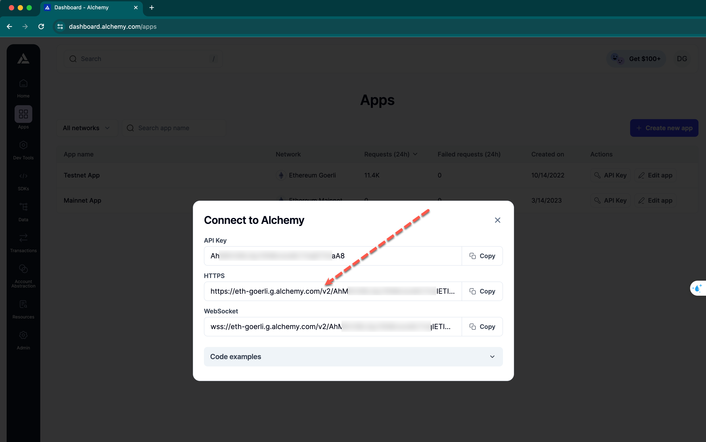

# Testing Guide

This guide will teach you how to run a Validator node locally using Docker. The Validator node will be configured to connect to the Goerli testnet.

## Install docker

1. Update your existing list of packages.

```sh
sudo apt update
```

2. Install a few prerequisite packages which let apt use packages over HTTPS.

```sh
sudo apt install -y apt-transport-https ca-certificates curl software-properties-common
```

3. Add the GPG key for the official Docker repository to your system.

```sh
curl -fsSL https://download.docker.com/linux/ubuntu/gpg | sudo apt-key add -
```

Add the Docker repository to APT sources.

```sh
sudo add-apt-repository "deb [arch=amd64] https://download.docker.com/linux/ubuntu focal stable"
```

4. Install Docker.

```sh
sudo apt install -y docker-ce
```

Docker should now be installed, the daemon started, and the process enabled to start on boot. Check that it’s running.

```sh
sudo systemctl status docker
```

## Using Docker

### Run PostgreSQL

1. Run PostgreSQL in a Docker container. You can replace mysecretpassword with your own password.

```sh
docker run --name eqt-postgres -e POSTGRES_PASSWORD=mysecretpassword -p 5432:5432 -d postgres
```

2. Confirm that the container is running. Note the 5432 port is published 0.0.0.0:5432->5432/tcp and therefore accessible outside of Docker.

```sh
docker ps -a -f name=eqt-postgres
```

If the container is running successfully, the output shows a healthy status:

```sh
CONTAINER ID   IMAGE      COMMAND                  CREATED         STATUS         PORTS                    NAMES
dc08cfad2a16   postgres   "docker-entrypoint.s…"   3 minutes ago   Up 3 minutes   0.0.0.0:5432->5432/tcp   eqt-postgres
```

### Run Validator node

1. Create a local directory to hold the Equito Protocol data

```sh
mkdir ~/.equito-node
```

2. Run the following command to create .env file and set environment variables. It includes setttings of wallet and API keys. The wallet should be include more than 100 ALGO, 1 Goerli ETH and 1 BNB.

These are the faucets to get test tokens.

[Algorand faucet](https://bank.testnet.algorand.network/)

[Goerli ETH faucet](https://goerlifaucet.com/)

[BNB faucet](https://testnet.binance.org/faucet-smart)

See how to get the API keys in [Configuring node](#configuring-node)

```sh
echo "
PORT=7890
ALGO_WALLET_MNEMONIC=<algorand-wallet-mnemonic>
ETH_WALLET_PRIVATE_KEY=<ethereum-wallet-private-key>
BNB_WALLET_PRIVATE_KEY=<binance-wallet-private-key>
ETH_MAINNET_ENDPOINT=<your-mainnet-endpoint>
ETH_TESTNET_ENDPOINT=<your-testnet-endpoint>
BNB_MAINNET_ENDPOINT=<your-mainnet-endpoint>
BNB_TESTNET_ENDPOINT=<your-testnet-endpoint>
" > ~/.equito-node/.env
```

This is an example of .env setting.

```sh
echo "
PORT=7890
ALGO_WALLET_MNEMONIC=gift only mouse goddess city benefit obtain evoke excite predict safe neither purpose route sock unfold boil pass battle agent body what abandon finish anchor
ETH_WALLET_PRIVATE_KEY=756b7f2f95346df4767041da97be8f8c6cbd3cab9de46ef31c85b4af1c507c5a
BNB_WALLET_PRIVATE_KEY=40325b340a0755405f6e13c297511a793c29db6b91ed2f9d6999d5624caccf3c
ETH_MAINNET_ENDPOINT=https://mainnet.infura.io/v3/cb206f7f7ed64fb98108a56fac39f934
ETH_TESTNET_ENDPOINT=https://goerli.infura.io/v3/cb206f7f7ed64fb98108a56fac39f934
BNB_MAINNET_ENDPOINT=https://spring-summer-crater.bsc.quiknode.pro/b3119f82a5ba1cf011021703136fddfde26a69a2/
BNB_TESTNET_ENDPOINT=https://dark-wandering-tree.bsc-testnet.quiknode.pro/58aaf9b78f359d477e060faf24bb51c4c2d2389c/
" > ~/.equito-node/.env
```

These are the examples of endpoints.

**Infura** (Ethereum Mainnet & Testnet)

```sh
https://mainnet.infura.io/v3/cb206f7f7ed64fb98108a56fac39f934
https://goerli.infura.io/v3/cb206f7f7ed64fb98108a56fac39f934
```

**Alchemy** (Ethereum Mainnet & Testnet)

```sh
https://eth-mainnet.g.alchemy.com/v2/cpW9bVq33Ac6lBjI2pwc266AKbGvl9MF
https://eth-goerli.g.alchemy.com/v2/ldhqIo8W9kfM6jHV31W4Xuvk2O2PMYP8
```

**QuickNode** (Binance Mainnet & Testnet)

```sh
https://spring-summer-crater.bsc.quiknode.pro/b3119f82a5ba1cf011021703136fddfde26a69a2/
https://dark-wandering-tree.bsc-testnet.quiknode.pro/58aaf9b78f359d477e060faf24bb51c4c2d2389c/
```

You can confirm that the variables are set correctly in .env file.

```sh
cat ~/.equito-node/.env
```

3. Start the Equito Node by running the Docker image.

```sh
cd ~/.equito-node && docker run --env-file ~/.equito-node/.env -d --platform linux/x86_64/v8 --name equito-bridge -it -p 7890:7890 robindev912/equito-validator-node
```

4. Confirm that the container is running. Note the 7890 port is published 0.0.0.0:7890->7890/tcp and therefore accessible outside of Docker.

```sh
docker ps -a -f name=equito-bridge
```

If the container is running successfully, the output shows a healthy status:

```
CONTAINER ID   IMAGE                               COMMAND                  CREATED         STATUS         PORTS                                       NAMES
63318f25608e   robindev912/equito-validator-node   "/sbin/tini -- npm s…"   7 minutes ago   Up 7 minutes   0.0.0.0:7890->7890/tcp, :::7890->7890/tcp   equito-bridge
```

## Configuring node

### Blockchain API endpoints

The following services offer Ethereum and Binance API endpoints to work with the Validator node.
It is necessary to get API endpoints and set them in .env file.

#### Alchemy

Visit [Alchemy](https://www.alchemy.com/) and create API endpoints.




#### Infura

Visit [Infura](https://www.infura.io/) and create API endpoints.


#### QuickNode

Visit [QuickNode](https://www.quicknode.com/) and create API endpoints.


These are the only environment variables that are required for a Validator node to run.
Configure the necessary environment variables in the .env file by obtaining API endpoints from relevant external services.
We recommend you to use premium API endpoints for optimal performance and high quality.

### Open ports for Node API

Ensure that port 7890 is open for communication with the Equito Node APIs.
